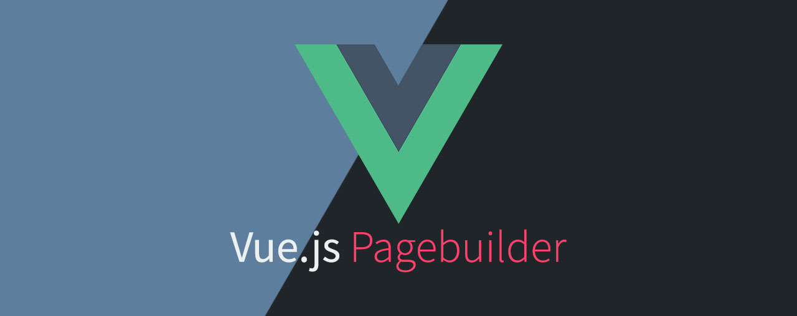

 
 

# Vue Pagebuilder

### Notes

This package is still in development and is NOT yet intended for production use.
 
The README for customization will be coming soon.

#### Installtion

~~~
npm install @chrisbielak/vue-pagebuilder

or use yarn

yarn add @chrisbielak/vue-pagebuilder
~~~

#### Set up TypeScript
The Pagebuilder was written in TypeScript, which will be installed automatically
with all required dependencies.

You can skip this step if you want to use the Pagebuilder within a TypeScript ready Vue.js SPA.

If you want to use it in a Laravel project you have to make the project TypeScript ready.

First of all you have to modify your `webpack.mix.json`.
~~~
...

  module:{
         rules:[
             {
                 test: /\.tsx?$/,
                 loader: "ts-loader",
                 exclude: /node_modules/
             }
         ]
     },
     resolve: {
         extensions: ['*', '.js', '.jsx', '.vue', '.ts', '.tsx'],
 
         alias:{
             '@': path.resolve(__dirname, './resources/js')
         }
     },
     
...
~~~

Because of dynamic importing of the Pagebuilder elements it's recommended to define a path for the chunk files.

A simple implementation can look like this:
~~~
let chunkFilename = 'js/chunks/[name].js';
mix.js('resources/js/app.js', 'public/js')
    .sass('resources/sass/app.scss', 'public/css');
mix.webpackConfig({
    output: {
        publicPath: '/',
        chunkFilename: chunkFilename
    },
    module:{
        rules:[
            {
                test: /\.tsx?$/,
                loader: "ts-loader",
                exclude: /node_modules/
            }
        ]
    },
    resolve: {
        extensions: ['*', '.js', '.jsx', '.vue', '.ts', '.tsx'],

        alias:{
            '@': path.resolve(__dirname, './resources/js')
        }
    },
});
~~~

The last step that needs to be done is to create the `tsconfig.json` file.

I use the default `tsconfig.json` which is created by the Vue cli.

~~~
{
    "compilerOptions": {
        "target": "esnext",
        "module": "esnext",
        "strict": true,
        "jsx": "preserve",
        "importHelpers": true,
        "moduleResolution": "node",
        "experimentalDecorators": true,
        "esModuleInterop": true,
        "allowSyntheticDefaultImports": true,
        "strictPropertyInitialization": false,
        "sourceMap": true,
        "baseUrl": ".",
        "declaration": false,
        "types": [
        ],
        "paths": {
            "@/*": [
                "resources/js/*"
            ]
        },
        "lib": [
            "esnext",
            "dom",
            "dom.iterable",
            "scripthost"
        ]
    },
    "include": [
        "resources/**/*.ts",
        "resources/**/*.tsx",
        "resources/**/*.vue"
    ],
    "exclude": [
        "node_modules"
    ]
}
~~~

#### How to use the Pagebuilder

First you have to register the component and register the Vuex store which has a default set up.

~~~
import PagebuilderComponent from "./pagebuilder/components/PagebuilderComponent/PagebuilderComponent";
import store from './pagebuilder/store/store'

new Vue({
    el: '#app',
    components: {
        PagebuilderComponent,
    },
    store
});
~~~

Now you can use the `pagebuilder-component` inside your project wherever it's needed.

~~~
<pagebuilder-component></pagebuilder-component>
~~~
